# Architecture Diagram: M365 Exchange Online Migration

> **Template Status**: Live | **Version**: 0.11.2 | **Command**: `/arckit.diagram`

## Document Control

| Field | Value |
|-------|-------|
| **Document ID** | ARC-001-DIAG-CONTAINER-v1.1 |
| **Document Type** | Architecture Diagram - C4 Container (Level 2) |
| **Project** | Exchange Online Migration to Microsoft 365 (Project 001) |
| **Classification** | OFFICIAL |
| **Status** | DRAFT |
| **Version** | 1.1 |
| **Created Date** | 2025-10-20 |
| **Last Modified** | 2026-01-26 |
| **Review Cycle** | Quarterly |
| **Next Review Date** | 2026-04-26 |
| **Owner** | Enterprise Architecture Team, Cabinet Office |
| **Reviewed By** | PENDING |
| **Approved By** | PENDING |
| **Distribution** | Internal - Architecture Team, Project Stakeholders |

## Revision History

| Version | Date | Author | Changes | Approved By | Approval Date |
|---------|------|--------|---------|-------------|---------------|
| 1.0 | 2025-10-20 | Enterprise Architecture Team | Initial C4 Container diagram for M365 Exchange Online migration | PENDING | PENDING |
| 1.1 | 2026-01-26 | ArcKit AI | Updated to template v0.11.2 format (Document Control, Revision History) | PENDING | PENDING |

---

## Document Purpose

This architecture diagram provides a C4 Container-level view of the Microsoft 365 Exchange Online migration architecture for the Cabinet Office. It shows technical architecture components including UK data sovereignty, security controls, and compliance requirements. This diagram supports architecture review (Gate 3), vendor evaluation, and security validation.

---

## Diagram

```mermaid
C4Container
    title Container Diagram - M365 Exchange Online Migration (Cabinet Office)

    Person(user, "Cabinet Office User", "3,500 civil servants requiring secure email access")
    Person(admin, "IT Administrator", "Exchange/M365 administrators managing tenant")
    Person(compliance, "Compliance Officer", "Information governance and eDiscovery")
    Person(mobile_user, "Mobile User", "Users accessing email via mobile devices")

    System_Ext(onprem_ad, "On-Premises Active Directory", "Windows Server 2016 AD for hybrid identity")
    System_Ext(onprem_exchange, "On-Premises Exchange 2016", "Legacy email system (to be decommissioned)")
    System_Ext(intune_devices, "Managed Devices", "Windows 10/11, iOS, Android devices")
    System_Ext(sentinel, "Microsoft Sentinel", "SIEM for security monitoring")
    System_Ext(gov_services, "Cross-Government Email", "*.gov.uk email systems")

    System_Boundary(m365, "Microsoft 365 (UK South/UK West)") {
        Container(aad, "Azure AD (Entra ID)", "Cloud Identity Platform", "Cloud identity, SSO, Conditional Access [Commodity 0.95]")
        Container(aad_connect, "Azure AD Connect", "Identity Sync Service", "Sync on-prem AD to Azure AD [Product 0.70]")

        Container(exchange_online, "Exchange Online", "Cloud Email Service", "Mailbox hosting, 3,500 users, 52TB, UK data residency [Commodity 0.92]")
        Container(owa, "Outlook Web App", "Web Application", "Browser-based email, WCAG 2.2 AA compliant [Commodity 0.90]")
        Container(outlook_desktop, "Outlook Desktop", "Desktop Client", "Offline email access via Autodiscover [Commodity 0.90]")
        Container(outlook_mobile, "Outlook Mobile", "Mobile App", "iOS/Android email client [Commodity 0.90]")

        Container(defender, "Microsoft Defender for Office 365", "Security Platform", "Anti-phishing, Safe Links, Safe Attachments, threat protection [Product 0.75]")
        Container(purview, "Microsoft Purview", "Information Governance", "Sensitivity labels (OFFICIAL/OFFICIAL-SENSITIVE), DLP, retention [Product 0.72]")
        Container(intune, "Microsoft Intune", "MDM/MAM Platform", "Device compliance policies, Conditional Access enforcement [Product 0.73]")

        ContainerDb(exchange_mailboxes, "Exchange Mailboxes", "Cloud Storage", "52TB mailbox data, UK South primary, UK West DR, AES-256 encryption [Commodity 0.95]")
        ContainerDb(audit_log, "Unified Audit Log", "Audit Storage", "7-year retention for OFFICIAL records, immutable logging [Product 0.70]")

        Container(ediscovery, "eDiscovery", "Legal Hold Platform", "FOI requests, legal hold, content search across all mailboxes [Product 0.68]")
        Container(compliance_center, "M365 Compliance Center", "Admin Portal", "Compliance posture management, policy configuration [Product 0.72]")
        Container(admin_center, "M365 Admin Center", "Admin Portal", "Tenant management, user provisioning, service health [Commodity 0.88]")
    }

    Rel(user, owa, "Access email", "HTTPS with MFA")
    Rel(user, outlook_desktop, "Access email", "MAPI/HTTP with Autodiscover")
    Rel(mobile_user, outlook_mobile, "Access email", "ActiveSync with Intune compliance")

    Rel(owa, exchange_online, "Retrieves mailbox data", "HTTPS")
    Rel(outlook_desktop, exchange_online, "Syncs mailbox", "MAPI/HTTP")
    Rel(outlook_mobile, exchange_online, "Syncs mailbox", "ActiveSync")

    Rel(aad, exchange_online, "Authenticates users", "OAuth 2.0 / OIDC")
    Rel(aad_connect, onprem_ad, "Syncs identities", "LDAP every 30 min")
    Rel(aad_connect, aad, "Provisions accounts", "Graph API")

    Rel(exchange_online, exchange_mailboxes, "Stores email", "Encrypted SQL")
    Rel(exchange_online, defender, "Scans threats", "Real-time")
    Rel(exchange_online, purview, "Applies labels/DLP", "Policy Engine")
    Rel(exchange_online, audit_log, "Logs activities", "Audit pipeline")
    Rel(exchange_online, gov_services, "Routes email", "SMTP with TLS 1.3")

    Rel(onprem_exchange, exchange_online, "Hybrid migration", "MRS Proxy (Migration batch)")

    Rel(intune, intune_devices, "Enforces compliance", "MDM policies")
    Rel(aad, intune, "Queries device status", "Graph API")

    Rel(admin, admin_center, "Manages tenant", "HTTPS with PIM")
    Rel(admin, aad_connect, "Configures sync", "Local admin")
    Rel(compliance, compliance_center, "Reviews compliance", "HTTPS with RBAC")
    Rel(compliance, ediscovery, "Searches mailboxes", "Content Search API")

    Rel(audit_log, sentinel, "Streams events", "Event Hub <5 min latency")
    Rel(defender, sentinel, "Sends alerts", "Security Graph API")

    UpdateLayoutConfig($c4ShapeInRow="4", $c4BoundaryInRow="1")
```

**View this diagram**:
- **GitHub**: Renders automatically in markdown preview
- **VS Code**: Install Mermaid Preview extension
- **Online**: https://mermaid.live (paste code above)
- **Export**: Use mermaid.live to export as PNG/SVG/PDF

---

## Component Inventory

| Component | Type | Technology | Responsibility | Evolution Stage | Build/Buy |
|-----------|------|------------|----------------|-----------------|-----------|
| Azure AD (Entra ID) | Identity Platform | Microsoft Cloud Identity | User authentication, SSO, MFA, Conditional Access policies | Commodity 0.95 | USE |
| Azure AD Connect | Identity Sync | Sync Service | Synchronize on-prem AD to Azure AD every 30 minutes | Product 0.70 | USE |
| Exchange Online | Email Service | Microsoft 365 | Mailbox hosting, email routing, calendaring, contacts | Commodity 0.92 | USE |
| Outlook Web App (OWA) | Web Application | HTML5/JavaScript | Browser-based email access, WCAG 2.2 AA accessible | Commodity 0.90 | USE |
| Outlook Desktop | Desktop Client | C++/.NET | Offline email access with local cache | Commodity 0.90 | USE |
| Outlook Mobile | Mobile App | Native iOS/Android | Mobile email access with Intune integration | Commodity 0.90 | USE |
| Microsoft Defender for Office 365 | Security Platform | Cloud Security | Anti-phishing, Safe Links, Safe Attachments, Zero-day protection | Product 0.75 | BUY |
| Microsoft Purview | Governance Platform | Information Protection | Sensitivity labels, DLP, retention policies, classification | Product 0.72 | BUY |
| Microsoft Intune | MDM/MAM | Device Management | Device compliance, app protection, Conditional Access enforcement | Product 0.73 | BUY |
| Exchange Mailboxes | Cloud Storage | Azure Storage (UK) | Mailbox data storage with AES-256, UK South + UK West redundancy | Commodity 0.95 | USE |
| Unified Audit Log | Audit Storage | Azure Table Storage | Immutable audit logging with 7-year retention for OFFICIAL records | Product 0.70 | BUY |
| eDiscovery | Legal Platform | Purview eDiscovery | Content search, legal hold, FOI request support | Product 0.68 | BUY |
| M365 Compliance Center | Admin Portal | Web Portal | Compliance score, policy management, data governance | Product 0.72 | USE |
| M365 Admin Center | Admin Portal | Web Portal | User provisioning, license management, service health dashboard | Commodity 0.88 | USE |
| On-Premises AD | Identity Source | Windows Server 2016 | Legacy identity directory (hybrid coexistence) | Product 0.65 | EXISTING |
| On-Premises Exchange 2016 | Legacy Email | Exchange Server | Source system for migration (to be decommissioned Month 11) | Product 0.60 | DECOMM |

**Evolution Stage Legend**:
- **Genesis (0.0-0.25)**: Novel, unproven, rapidly changing
- **Custom (0.25-0.50)**: Bespoke, emerging practices
- **Product (0.50-0.75)**: Commercial products with feature differentiation
- **Commodity (0.75-1.0)**: Utility services, standardized

**Build/Buy Decision**:
- **USE**: Commodity cloud/utility services (M365 native components)
- **BUY**: Product components with mature market (M365 E5 licensed features)
- **EXISTING**: Legacy components during migration phase
- **DECOMM**: Components to be decommissioned post-migration

---

## Architecture Decisions

### Key Design Decisions

**Decision 1**: UK Data Residency (UK South Primary, UK West DR)
- **Context**: Cabinet Office handles OFFICIAL classified information requiring UK data sovereignty per Government Security Classifications Policy and Architecture Principle 1 (Cloud-First with UK Sovereignty)
- **Decision**: Configure M365 tenant for UK South (primary region), UK West (disaster recovery), Multi-Geo disabled
- **Rationale**:
  - Legal requirement: OFFICIAL data must remain in UK jurisdiction
  - TCoP Point 5 (Cloud First) compliance with UK residency constraint
  - Architecture Principle 1 mandates UK regions only (UK South/UK West)
  - NCSC Cloud Security Principle 2 (Asset Protection and Resilience) requires multi-region within UK
- **Consequences**:
  - ✅ Full compliance with data sovereignty requirements
  - ✅ Multi-region resilience within UK geographic boundaries
  - ✅ 99.9% SLA from Microsoft with UK failover
  - ⚠️ Slightly higher latency for international travel (mitigated by Outlook Anywhere cached mode)
  - ⚠️ No Multi-Geo capability (acceptable: no cross-border requirements)

**Decision 2**: Hybrid Identity with Azure AD Connect
- **Context**: Cabinet Office has 3,500 users in on-premises Active Directory requiring migration to cloud while maintaining SSO and password sync
- **Decision**: Deploy Azure AD Connect with Password Hash Synchronization (PHS) for hybrid identity
- **Rationale**:
  - PHS provides most resilient authentication method (cloud continues if on-prem fails)
  - Architecture Principle 11 (Zero Trust) requires cloud-native authentication
  - Enables Conditional Access policies based on Azure AD signals
  - SSO experience for users (no password changes during migration)
  - No federation infrastructure (simpler, more resilient than ADFS)
- **Consequences**:
  - ✅ High availability: Cloud authentication works even if on-prem AD offline
  - ✅ Simplified architecture: No ADFS or federation servers required
  - ✅ Enables passwordless authentication roadmap (FIDO2, Authenticator)
  - ⚠️ 30-minute sync delay for new user provisioning (acceptable per SLA)
  - ⚠️ Password changes sync within 2 minutes (meets user expectations)

**Decision 3**: Microsoft Defender for Office 365 Plan 2
- **Context**: Cabinet Office email is frequent target for phishing and nation-state attacks; Architecture Principle 3 (Security by Design) mandates advanced threat protection
- **Decision**: Deploy Defender for Office 365 Plan 2 with Safe Links, Safe Attachments, Anti-Impersonation, and Threat Investigation
- **Rationale**:
  - NCSC Cloud Security Principle 5 (Operational Security) requires proactive threat protection
  - NFR-SEC-005 mandates continuous vulnerability management
  - Protects against zero-day attacks, BEC (Business Email Compromise), whaling
  - Threat Explorer provides security analysts with investigation capabilities
  - Attack simulation training for user awareness (NFR-U-001)
- **Consequences**:
  - ✅ <5% reduction in successful phishing attacks (Cabinet Office target)
  - ✅ Real-time URL rewriting for Safe Links (click-time protection)
  - ✅ Sandbox detonation for attachments before delivery
  - ⚠️ Slight email delivery delay (<30 seconds 95th percentile, acceptable per NFR-P-001)
  - ⚠️ Additional licensing cost (already procured in M365 E5)

**Decision 4**: Sensitivity Labels (OFFICIAL, OFFICIAL-SENSITIVE)
- **Context**: Government Security Classifications Policy requires all Cabinet Office information to be classified; Architecture Principle 6 (Data Classification) mandates protective marking
- **Decision**: Deploy Microsoft Purview sensitivity labels with automatic labeling for OFFICIAL (default) and OFFICIAL-SENSITIVE content
- **Rationale**:
  - Legal requirement: Government Security Classifications Policy
  - FR-005 mandates sensitivity labels with visual markings and encryption
  - DLP policies prevent unauthorized sharing of OFFICIAL-SENSITIVE externally
  - Labels embedded in metadata (persistent protection even if file exported)
  - Auto-classification based on keywords (e.g., "Cabinet Paper", "OFFICIAL-SENSITIVE")
- **Consequences**:
  - ✅ 100% compliance with Government Security Classifications Policy
  - ✅ DLP blocks external sharing of OFFICIAL-SENSITIVE (zero data leakage target)
  - ✅ Audit trail for all label application (NFR-C-002)
  - ⚠️ User training required (label selection, classification guidance)
  - ⚠️ False positives on auto-classification (<5% target, user can override with justification)

**Decision 5**: Conditional Access Zero Trust Policies
- **Context**: Architecture Principle 11 (Zero Trust) requires explicit verification for every access request; remote access and mobile devices increase attack surface
- **Decision**: Deploy 5 Conditional Access policies (MFA mandatory, block legacy auth, require compliant device, UK geofencing, high-risk controls)
- **Rationale**:
  - NFR-SEC-001 mandates 100% MFA enforcement (no exceptions except 2 break-glass accounts)
  - Zero Trust principle: Verify explicitly, least privilege, assume breach
  - Device compliance via Intune prevents jailbroken/compromised devices
  - Geofencing blocks non-UK access (with approved traveler exception list)
  - Legacy authentication (POP3/IMAP basic auth) is vulnerable, must be blocked
- **Consequences**:
  - ✅ 100% MFA coverage (NCSC Cloud Security Principle 9)
  - ✅ Legacy auth blocked (90% reduction in credential stuffing attacks)
  - ✅ Non-compliant devices blocked (prevents BYOD without Intune enrollment)
  - ⚠️ User enrollment in MFA required (1-week enrollment campaign)
  - ⚠️ Travel exceptions require 5-day approval process (acceptable)

**Decision 6**: 7-Year Audit Log Retention
- **Context**: Government Security Classifications Policy requires 7-year audit retention for OFFICIAL records; Public Records Act requires evidence for FOI requests
- **Decision**: Enable Unified Audit Log with 7-year retention (10-year for admin activities) and real-time streaming to Microsoft Sentinel SIEM
- **Rationale**:
  - NFR-C-002 mandates 7-year audit retention for OFFICIAL compliance
  - FR-011 requires audit logs for all privileged operations
  - Architecture Principle 19 (Audit Logging) mandates immutable logging
  - SIEM integration enables real-time threat detection and incident response
  - FOI requests require historical email search capability (FR-009)
- **Consequences**:
  - ✅ Full compliance with Government Security Classifications Policy
  - ✅ Real-time security monitoring (<5 min event ingestion to Sentinel per INT-003)
  - ✅ 7-year searchable history for FOI, eDiscovery, investigations
  - ⚠️ Additional M365 E5 licensing required (already procured)
  - ⚠️ Azure storage costs for long-term audit log retention (£15K/year, budgeted)

**Decision 7**: Phased Migration with Pilot (Finance Directorate)
- **Context**: BR-005 requires phased migration timeline; risk of large-scale migration failure requires validation approach
- **Decision**: Pilot migration (Month 3, 100 users in Finance directorate) followed by 3 phased migrations (Months 5-9, 1,200/1,200/1,000 users)
- **Rationale**:
  - Pilot validates migration process, tooling, and rollback procedures
  - Finance directorate integrates with financial systems (validates third-party SMTP relay)
  - Lessons learned from pilot inform Phase 1-3 migrations
  - Phased approach minimizes business impact (not all directorates affected simultaneously)
  - Weekend cutover windows minimize downtime (NFR-A-001 99.9% availability)
- **Consequences**:
  - ✅ Pilot reduces risk of large-scale failure (validate before scaling)
  - ✅ Finance validation covers financial system integrations (critical path)
  - ✅ 6-month hybrid coexistence provides rollback window
  - ⚠️ 6-month hybrid overhead (on-prem Exchange must remain operational)
  - ⚠️ User confusion during hybrid (some users on-prem, some cloud)

### Technology Choices

| Technology | Purpose | Rationale | Evolution Stage |
|------------|---------|-----------|-----------------|
| Microsoft Exchange Online | Email hosting | TCoP Point 5 (Cloud First), commodity email service, 99.9% SLA, UK data residency | Commodity 0.92 |
| Azure AD (Entra ID) | Cloud identity | Zero Trust foundation, Conditional Access, MFA, NCSC Cloud Security Principle 10 | Commodity 0.95 |
| Microsoft Defender for Office 365 | Email security | Advanced threat protection, zero-day defense, BEC prevention, NCSC Principle 5 | Product 0.75 |
| Microsoft Purview | Information governance | Sensitivity labels (OFFICIAL/OFFICIAL-SENSITIVE), DLP, retention (Public Records Act) | Product 0.72 |
| Microsoft Intune | Device management | Device compliance for Conditional Access, BYOD support, remote wipe, NCSC EUD Guidance | Product 0.73 |
| Azure AD Connect (PHS) | Identity sync | Hybrid identity, password hash sync (no federation), resilient authentication | Product 0.70 |
| Unified Audit Log | Audit logging | 7-year retention for OFFICIAL, immutable logging, SIEM integration (NFR-C-002) | Product 0.70 |
| Microsoft Sentinel | SIEM | Real-time threat detection, incident response, compliance monitoring (INT-003) | Product 0.68 |
| Outlook Web App | Web email client | WCAG 2.2 AA accessible, browser-based, no VPN required (flexible working, BR-004) | Commodity 0.90 |
| Outlook Desktop | Desktop email client | Offline access, cached mode, Autodiscover, large mailbox performance | Commodity 0.90 |
| Outlook Mobile | Mobile email client | iOS/Android native, Intune app protection, secure mobile access (BR-004) | Commodity 0.90 |

---

## Requirements Traceability

**Requirements Coverage**:

| Requirement ID | Description | Component(s) | Coverage Status |
|----------------|-------------|--------------|-----------------|
| BR-001 | Cloud-First Mandate Compliance | Exchange Online, Azure AD, M365 tenant (UK regions) | ✅ Covered |
| BR-002 | Cost Reduction (£800K savings) | M365 E5 licensing, decommission on-prem Exchange | ✅ Covered |
| BR-003 | 99.9% SLA and UK Multi-Region Resilience | Exchange Online (UK South/UK West), Microsoft SLA | ✅ Covered |
| BR-004 | Secure Mobile Access (Flexible Working) | Outlook Mobile, Intune device compliance, Conditional Access | ✅ Covered |
| BR-005 | Phased Migration Timeline (9 months) | Migration plan (Pilot Month 3, Phases 1-3 Months 5-9) | ✅ Covered |
| BR-006 | User Adoption and Training (80% proficiency) | User training program, M365 Champions network | ⚠️ Partially (training plan required) |
| BR-007 | OFFICIAL Classification Compliance | Purview sensitivity labels, DLP, audit logging, SIRO sign-off | ✅ Covered |
| FR-001 | Zero Data Loss Migration | Migration tooling with validation (item count match 100%) | ✅ Covered |
| FR-002 | Hybrid Identity with Azure AD Connect | Azure AD Connect with PHS, 30-min sync | ✅ Covered |
| FR-003 | UK Data Residency | M365 tenant UK South/UK West, Multi-Geo disabled | ✅ Covered |
| FR-004 | Conditional Access (Zero Trust) | 5 Conditional Access policies (MFA, device, location, legacy auth block) | ✅ Covered |
| FR-005 | Sensitivity Labels (OFFICIAL/OFFICIAL-SENSITIVE) | Purview sensitivity labels with auto-labeling | ✅ Covered |
| FR-006 | Data Loss Prevention (DLP) | Purview DLP policies (block external OFFICIAL-SENSITIVE, NI numbers) | ✅ Covered |
| FR-007 | Microsoft Defender for Office 365 | Defender Plan 2 (Safe Links, Safe Attachments, anti-phishing) | ✅ Covered |
| FR-008 | Retention Policies (Public Records Act) | Purview retention labels (1-20 years based on document type) | ✅ Covered |
| FR-009 | eDiscovery and Legal Hold | Purview eDiscovery, content search, legal hold workflows | ✅ Covered |
| FR-010 | Intune Mobile Device Management | Intune device compliance, Conditional Access integration | ✅ Covered |
| FR-011 | Unified Audit Log (7-year retention) | UAL with 7-year retention, SIEM integration (Sentinel) | ✅ Covered |
| FR-012 | Shared/Resource Mailboxes Migration | Migration plan includes 150 shared/resource mailboxes | ✅ Covered |
| FR-013 | Mail Flow Rules Migration | Transport rules migration from Exchange 2016 to Exchange Online | ✅ Covered |
| FR-014 | Outlook Web App (WCAG 2.2 AA) | OWA with accessibility compliance, screen reader support | ✅ Covered |
| FR-015 | Outlook Desktop/Autodiscover | Outlook desktop with Autodiscover, offline cached mode | ✅ Covered |
| NFR-P-001 | Email Delivery <30s (95th percentile) | Exchange Online routing, Defender scanning <30s | ✅ Covered |
| NFR-P-002 | OWA Page Load <2s (95th percentile) | OWA performance, CDN, UK region proximity | ✅ Covered |
| NFR-P-003 | Migration Throughput (300 mailboxes/48hr) | Migration tooling with throttling, 100 Mbps bandwidth | ✅ Covered |
| NFR-A-001 | 99.9% Service Availability | Microsoft 365 SLA, UK South + UK West multi-region | ✅ Covered |
| NFR-A-002 | Disaster Recovery (RPO 15 min, RTO 4 hr) | Microsoft continuous replication, automatic failover UK West | ✅ Covered |
| NFR-S-001 | User Growth Scalability (30% over 3 years) | M365 elastic scaling, no capacity constraints | ✅ Covered |
| NFR-S-002 | Storage Growth 52TB → 150TB | Exchange Online Archive auto-archive after 2 years | ✅ Covered |
| NFR-SEC-001 | 100% MFA Enforcement | Conditional Access policy (Require MFA for All Users) | ✅ Covered |
| NFR-SEC-002 | RBAC with PIM (Least Privilege) | Azure AD PIM for admin roles, 8-hour activation, approval workflows | ✅ Covered |
| NFR-SEC-003 | Encryption (TLS 1.3, AES-256) | TLS 1.3 in transit, AES-256 at rest (Microsoft-managed keys) | ✅ Covered |
| NFR-SEC-004 | Secrets Management (No creds in code) | Azure Key Vault for service account passwords, certs | ✅ Covered |
| NFR-C-001 | UK GDPR and Data Protection Act 2018 | PIA completed, UK data residency, SAR procedures (eDiscovery) | ✅ Covered |
| NFR-C-002 | Audit Logging (7-year retention) | Unified Audit Log, immutable, 7-year retention for OFFICIAL | ✅ Covered |
| NFR-C-003 | Public Records Act (20-year retention) | Purview retention labels, disposition workflows, National Archives transfer | ✅ Covered |
| NFR-U-002 | Accessibility (WCAG 2.2 AA) | OWA WCAG 2.2 AA, screen reader support (JAWS, NVDA) | ✅ Covered |
| NFR-M-001 | Observability and Monitoring | M365 Admin Center, Service Health, Unified Audit Log, Sentinel | ✅ Covered |
| NFR-I-001 | Open Standards (SMTP, OAuth 2.0) | Exchange Online SMTP/IMAP, Azure AD OAuth 2.0 / OIDC | ✅ Covered |
| NFR-I-002 | Cross-Government Integration | SMTP with TLS to *.gov.uk, Exchange Federation for free/busy | ✅ Covered |
| INT-001 | Azure AD Integration | OAuth 2.0 / OIDC authentication, <200ms token validation | ✅ Covered |
| INT-002 | Intune Integration (Device Compliance) | Conditional Access queries Intune, <1s compliance check | ✅ Covered |
| INT-003 | Microsoft Sentinel SIEM Integration | Event Hub streaming from UAL to Sentinel, <5 min latency | ✅ Covered |

**Coverage Summary**:
- **Total Requirements**: 41
- **Covered**: 40 (98%)
- **Partially Covered**: 1 (BR-006 requires training plan documentation)
- **Not Covered**: 0

---

## Integration Points

### External Systems

| External System | Interface | Protocol | Responsibility | SLA |
|----------------|-----------|----------|----------------|-----|
| On-Premises Active Directory | Azure AD Connect | LDAP | Identity synchronization (30-min sync interval) | 99.5% (on-prem infrastructure) |
| On-Premises Exchange 2016 | Migration Replication Service (MRS) | HTTPS/MRS Proxy | Mailbox migration, hybrid coexistence | 99% (migration window) |
| Managed Devices (Windows, iOS, Android) | Microsoft Intune | MDM/MAM APIs | Device compliance enforcement for Conditional Access | 99.9% |
| Microsoft Sentinel SIEM | Event Hub | Azure Event Hub | Real-time audit log streaming for threat detection | 99.9% |
| Cross-Government Email (*.gov.uk) | SMTP | SMTP with TLS 1.3 | Email routing to other UK Government departments | 99.9% delivery success, <1 min latency |
| National Archives | Export/Transfer | PST/EML export | Transfer of permanent records (20-year retention) | N/A (annual batch transfer) |

### APIs and Endpoints

| API | Endpoint | Method | Purpose | Authentication |
|-----|----------|--------|---------|----------------|
| Microsoft Graph API | https://graph.microsoft.com/v1.0/users | GET, POST, PATCH | User provisioning, mailbox management, Conditional Access policies | OAuth 2.0 (App Registration) |
| Exchange Online PowerShell | https://outlook.office365.com/powershell-liveid | Remote PowerShell | Mailbox configuration, migration management, mail flow rules | OAuth 2.0 / Modern Auth |
| Azure AD Graph API | https://graph.windows.net/{tenant}/users | GET, POST | Legacy identity operations (to be replaced by Microsoft Graph) | OAuth 2.0 |
| Unified Audit Log API | Search-UnifiedAuditLog | PowerShell Cmdlet | Audit log search for compliance, FOI requests, investigations | OAuth 2.0 (Admin credentials) |
| eDiscovery API | https://compliance.microsoft.com/api/ediscovery | GET, POST | Content search, legal hold, case management | OAuth 2.0 (eDiscovery permissions) |
| Intune Graph API | https://graph.microsoft.com/v1.0/deviceManagement | GET, POST | Device compliance queries, policy enforcement | OAuth 2.0 (Intune permissions) |

---

## Data Flow

### Data Sources

| Data Source | Type | Data Format | Update Frequency | Owner |
|-------------|------|-------------|------------------|-------|
| On-Premises Active Directory | Identity | LDAP directory | 30-minute sync (Azure AD Connect) | IT Infrastructure Team |
| On-Premises Exchange 2016 | Email | Mailbox database (EDB) | Incremental sync during migration | Exchange Admin Team |
| User Email Clients (Outlook, OWA, Mobile) | Email composition | MIME/SMTP | Real-time (user actions) | End Users |
| Managed Devices (Intune) | Device compliance status | JSON (Graph API) | Real-time (Conditional Access query) | IT Infrastructure Team |

### Data Sinks

| Data Sink | Type | Data Format | Retention | Backup |
|-----------|------|-------------|-----------|--------|
| Exchange Online Mailboxes | Mailbox storage | Exchange mailbox (EDB in Azure) | Active (while employed), Archive (2-20 years per label) | Microsoft continuous replication (UK South → UK West) |
| Unified Audit Log | Audit storage | Structured JSON events | 7 years (OFFICIAL), 10 years (admin activities) | Immutable Azure Table Storage, replicated to Sentinel |
| Microsoft Sentinel SIEM | SIEM storage | Security events | 90 days hot (searchable), 2 years archive | Azure Log Analytics, geo-redundant |
| eDiscovery Exports | Legal export | PST, EML, MSG | Case-dependent (legal hold duration) | Case-specific retention |
| National Archives | Permanent records | PST, PDF/A | Permanent (transferred at 20 years) | National Archives responsibility |

### PII Handling (UK GDPR / GDPR Compliance)

| Component | PII Type | Processing | Legal Basis | Retention | Deletion |
|-----------|----------|------------|-------------|-----------|----------|
| Exchange Online Mailboxes | Name, email address, email content, calendar appointments | Email storage and routing | Legitimate interest (employment contract, public task) | Active (while employed), 30-day offboarding grace period, Archive (2-20 years per retention label) | Secure deletion via Purview retention policies, audit trail logged |
| Azure AD (Entra ID) | Name, email, UPN, mobile number (MFA) | Authentication and identity management | Legitimate interest (employment contract, public task) | Active (while employed), 30-day offboarding grace period | Soft delete 30 days, hard delete after 60 days total |
| Unified Audit Log | User actions (sender, recipient, subject, date/time) | Audit logging for compliance and security | Legal obligation (Government Security Classifications Policy) | 7 years (OFFICIAL), 10 years (OFFICIAL-SENSITIVE) | Automated deletion after retention period |
| Intune (Device Management) | Device ID, OS version, compliance status, location (if enabled) | Device compliance enforcement | Legitimate interest (security policy enforcement) | Active (while device enrolled), 90 days after unenrollment | Automated deletion after 90 days |
| eDiscovery | Email content (potentially sensitive PII in emails) | Legal hold and FOI requests | Legal obligation (FOI Act, litigation) | Case-dependent (legal hold duration) | After case closure and legal hold release |
| Defender for Office 365 | Email sender/recipient, URL metadata, attachment hashes | Threat detection and protection | Legitimate interest (security protection) | 90 days (threat intelligence data) | Automated deletion after 90 days |

**DPIA Required**: Yes (completed and approved by Data Protection Officer)
**DPO Consulted**: Yes (DPO approval obtained for PIA, data flows, and retention schedules)

**Data Residency**: All PII stored in UK South (primary) and UK West (disaster recovery) regions only. Multi-Geo disabled. No cross-border data transfers except Microsoft support (Customer Lockbox approval required).

**Subject Access Requests (SAR)**: eDiscovery Content Search used for SAR responses within 20-day statutory deadline (Data Protection Act 2018).

---

## Security Architecture

### Security Zones

| Zone | Components | Security Level | Controls |
|------|------------|----------------|----------|
| **User Access Zone** | OWA, Outlook Desktop, Outlook Mobile, End-user clients | OFFICIAL | MFA mandatory, Conditional Access (device compliance, geofencing), session timeout 8 hours |
| **Cloud Identity Zone** | Azure AD, Azure AD Connect, Conditional Access policies | OFFICIAL-SENSITIVE | PIM for admin roles, break-glass accounts (2), admin workstation (PAW), MFA mandatory |
| **Email Service Zone** | Exchange Online mailboxes, mail flow | OFFICIAL / OFFICIAL-SENSITIVE | TLS 1.3 transport encryption, AES-256 at rest, DLP policies, sensitivity labels, Defender threat scanning |
| **Security & Compliance Zone** | Defender, Purview, Audit Log, eDiscovery, Sentinel | OFFICIAL-SENSITIVE | RBAC (Compliance Admin, Security Admin), PIM activation, immutable audit logs, 7-year retention |
| **Admin Management Zone** | M365 Admin Center, Compliance Center, Exchange Admin Center | OFFICIAL-SENSITIVE | PIM mandatory (8-hour activation), Conditional Access (admin-specific policies), audit logging |
| **Integration Zone** | Azure AD Connect, MRS Proxy (hybrid migration), Sentinel Event Hub | OFFICIAL | Service accounts in Azure Key Vault, certificate-based auth, TLS 1.3, audit logging |

### Security Controls

| Control | Type | Component(s) | Implementation |
|---------|------|--------------|----------------|
| **Multi-Factor Authentication (MFA)** | Authentication | Azure AD, Conditional Access | Microsoft Authenticator (preferred), FIDO2 security keys, SMS (fallback). 100% enrollment (NFR-SEC-001). Break-glass accounts exempt (2 accounts, secure vault). |
| **Conditional Access Policies** | Access Control | Azure AD, Exchange Online, all M365 services | 5 policies: (1) Require MFA for all users, (2) Block legacy auth, (3) Require compliant device, (4) UK geofencing, (5) High-risk session controls |
| **Device Compliance** | Endpoint Security | Intune, managed devices | Compliance policies: Encryption enabled, firewall on, antivirus current, OS version (Windows 10 1809+, iOS 14+, Android 10+), no jailbreak |
| **Data Loss Prevention (DLP)** | Data Protection | Purview, Exchange Online | Block external sharing of OFFICIAL-SENSITIVE, detect NI numbers/passport numbers, block personal cloud (Dropbox, Gmail), alert on bulk downloads >1GB |
| **Sensitivity Labels** | Data Classification | Purview, Exchange Online, mailboxes | OFFICIAL (default auto-applied), OFFICIAL-SENSITIVE (auto-labeling for keywords like "Cabinet Paper"). Visual markings (header/footer), encryption (OFFICIAL-SENSITIVE). |
| **Safe Links & Safe Attachments** | Email Security | Defender for Office 365 | Safe Links: URL rewriting and click-time protection. Safe Attachments: Sandbox detonation before delivery. Anti-impersonation for executive protection. |
| **Encryption at Rest** | Data Protection | Exchange Online mailboxes | AES-256 encryption with Microsoft-managed keys. Customer-managed keys (optional for OFFICIAL-SENSITIVE, not implemented in Phase 1). |
| **Encryption in Transit** | Network Security | All M365 communication | TLS 1.3 mandatory for SMTP transport, HTTPS for web clients, OAuth 2.0 for API calls. Legacy protocols (SSLv3, TLS 1.0/1.1) disabled. |
| **Privileged Identity Management (PIM)** | Admin Security | Azure AD admin roles | Global Admin (5 max), Exchange Admin (8), Security Admin (5). 8-hour max activation, approval workflow for Global/Exchange Admin. Break-glass accounts stored securely. |
| **Unified Audit Log** | Audit & Compliance | M365 Unified Audit Log | All user/admin activities logged. 7-year retention (OFFICIAL), 10-year (admin actions). Immutable (WORM), streamed to Sentinel for real-time SIEM. |
| **Legal Hold** | Data Retention | eDiscovery, Exchange Online | Override retention policies for FOI, litigation. In-place hold on mailboxes. Content preserved until hold released. |
| **Geofencing** | Access Control | Conditional Access | Block non-UK IP addresses. Approved traveler exception list (manual approval, 5-day SLA). Mitigates unauthorized access from foreign IPs. |
| **Anti-Phishing** | Email Security | Defender for Office 365 | Impersonation protection (executives, key users), mailbox intelligence, spoof intelligence. Quarantine suspicious emails, user reporting (Report Message add-in). |

### Authentication & Authorization

| Component | Authentication | Authorization | Session Management |
|-----------|----------------|---------------|-------------------|
| Exchange Online (OWA, Outlook) | Azure AD OAuth 2.0 / OIDC, MFA mandatory | Azure AD RBAC (Exchange recipient admin, mailbox access via delegation) | 8-hour continuous use OR 30-min inactivity timeout. Re-auth with MFA on new device. |
| Azure AD (Entra ID) | Password Hash Sync (PHS) from on-prem AD, MFA (Authenticator, FIDO2, SMS) | Azure AD roles (Global Admin, User Admin, etc.) with PIM for privileged roles | Token lifetime 1 hour (auto-refresh), session cookie 90 days (persistent login). |
| M365 Admin Center | Azure AD OAuth 2.0, PIM activation required for admin roles | Azure AD RBAC (Global Admin, Exchange Admin, Compliance Admin) | PIM activation 8-hour max, approval required for Global/Exchange Admin. |
| Intune (Device Management) | Azure AD OAuth 2.0, device certificate | Intune RBAC (Intune Administrator, Helpdesk Operator) | Session timeout 8 hours. Device compliance checked real-time on access request. |
| eDiscovery / Compliance Center | Azure AD OAuth 2.0, MFA mandatory | Purview RBAC (eDiscovery Manager, Compliance Admin, Reviewer) | Session timeout 8 hours. Privileged operations audited. |
| Microsoft Sentinel | Azure AD OAuth 2.0, MFA mandatory | Azure RBAC (Security Reader, Security Admin, Sentinel Contributor) | Session timeout 8 hours. SOC analysts require Security Reader minimum. |

**Passwordless Roadmap**: Target 50% passwordless authentication within 18 months (Windows Hello for Business, Microsoft Authenticator app, FIDO2 security keys for high-privilege accounts).

---

## Deployment Architecture

### Cloud Provider

**Provider**: Microsoft Azure (Microsoft 365)
**Primary Region**: UK South (London)
**Secondary Region**: UK West (Cardiff)
**Availability Zones**: 3 AZs per region (Microsoft-managed, transparent to tenant)
**Data Residency**: UK only (Multi-Geo disabled)

### Infrastructure Components

| Component | Type | Spec | HA | Backup |
|-----------|------|------|-----|--------|
| Exchange Online Mailboxes | Cloud Storage | 52TB initial (100GB per user), 100TB Year 3 | UK South (primary) + UK West (DR), 3 AZs per region | Continuous replication to secondary region, Microsoft-managed backup (14-day recovery) |
| Azure AD (Entra ID) | Cloud Identity Platform | 3,500 users, 5 Global Admins (PIM), 8 Exchange Admins (PIM) | Multi-region (global Microsoft infrastructure), 99.99% SLA | Microsoft geo-redundant replication, immutable audit logs |
| Azure AD Connect | Sync Service | VM 4 vCPU, 8GB RAM, 100GB SSD | Single server (acceptable: cloud auth works if on-prem fails) | Daily VM snapshot, disaster recovery runbook (rebuild in 4 hours) |
| Microsoft Defender for Office 365 | Security Service | Cloud-native, elastic | Microsoft-managed multi-region | N/A (stateless threat intelligence, logs retained 90 days) |
| Microsoft Purview | Governance Platform | Cloud-native, elastic | Microsoft-managed multi-region | Policy config backed up via M365DSC, 7-year audit retention |
| Unified Audit Log | Audit Storage | Azure Table Storage, 7-year retention | Geo-redundant (UK South + UK West) | Immutable WORM storage, streamed to Sentinel (90-day hot, 2-year archive) |
| Microsoft Intune | MDM/MAM Service | Cloud-native, elastic, 3,500 devices | Microsoft-managed multi-region | Policy config backed up via Intune Graph API export |
| Microsoft Sentinel | SIEM | Log Analytics workspace, UK South region | Zone-redundant, geo-replicated | 90-day hot storage, 2-year archive (Azure Storage) |

### Network Architecture

**M365 Network Connectivity**:
- **Direct Internet Breakout**: Cabinet Office firewall with M365 network optimization (ExpressRoute NOT required for M365)
- **Bandwidth**: 100 Mbps dedicated for M365 traffic (10 concurrent migrations at 10 Mbps each)
- **Latency**: <20ms from Cabinet Office to UK South region (validated via latency tests)
- **DNS**: Split-brain DNS for hybrid coexistence (on-prem Exchange 2016 + Exchange Online)
- **Autodiscover**: SRV records for Exchange Online Autodiscover (autodiscover.cabinetoffice.gov.uk → autodiscover.outlook.com)
- **MX Record**: Cutover during migration phases (on-prem Exchange → Exchange Online protection)

**Hybrid Configuration**:
- **Exchange Hybrid**: OAuth authentication between on-prem Exchange 2016 and Exchange Online
- **MRS Proxy**: Migration Replication Service endpoint for mailbox migration
- **Free/Busy Sharing**: Exchange Federation for calendar free/busy between on-prem and cloud
- **Mail Flow**: Centralized mail transport (all inbound/outbound via Exchange Online Protection after cutover)

**Firewall Rules** (Cabinet Office egress):
- Allow TCP 443 (HTTPS) to *.outlook.com, *.office365.com, *.microsoft.com
- Allow TCP 25, 587 (SMTP) to *.protection.outlook.com
- Allow UDP 3478 (Teams media - future workload, not in scope for this migration)
- Allow Azure AD Connect sync traffic (HTTPS 443) to *.windows.net

---

## Non-Functional Requirements

### Performance

| Requirement | Target | Component(s) | How Achieved |
|-------------|--------|--------------|--------------|
| Email Delivery Latency (p95) | <30 seconds | Exchange Online, Defender for Office 365 | Defender scanning <5 seconds, Exchange routing <10 seconds, network latency <5 seconds. UK South region proximity (<20ms latency). |
| OWA Page Load Time (p95) | <2 seconds | Outlook Web App, Azure CDN | CDN-accelerated static assets, UK South region, optimized JavaScript bundles. Monitor with synthetic transactions (Application Insights). |
| Mailbox Migration Throughput | 300 mailboxes per 48-hour weekend window | Migration tooling (BitTitan MigrationWiz), 100 Mbps bandwidth | 10 concurrent migration threads at 10 Mbps each, average 15GB per mailbox = 20 hours per batch. Incremental sync minimizes cutover time. |
| Token Validation Latency | <200ms (p95) | Azure AD (INT-001 SLA) | Azure AD global infrastructure, cached token validation, UK region affinity. |
| Device Compliance Check | <1 second (p95) | Intune, Conditional Access (INT-002 SLA) | Real-time Intune Graph API query, compliance status cached 8 hours. |
| Audit Log Ingestion to SIEM | <5 minutes | Unified Audit Log, Azure Event Hub, Sentinel (INT-003 SLA) | Event Hub streaming pipeline, 10,000 events/second throughput, Sentinel ingestion <2 min. |

### Scalability

| Scalability Type | Approach | Component(s) | Max Scale |
|-----------------|----------|--------------|-----------|
| **User Growth** | Elastic cloud scaling | Exchange Online, Azure AD, all M365 services | 30% growth over 3 years (3,500 → 4,550 users). M365 elastic, no capacity constraints. License procurement required. |
| **Storage Growth** | Auto-archive to Exchange Online Archive | Exchange Online mailboxes | 52TB → 150TB over 3 years. Auto-archive after 2 years, unlimited archive storage (M365 E5 includes Exchange Online Archiving). |
| **Mailbox Size** | Mailbox quota 100GB, archive unlimited | Exchange Online mailboxes | 100GB primary mailbox, unlimited archive. Large mailboxes (>50GB) pre-migration cleanup recommended. |
| **Concurrent Users** | OWA concurrent sessions | Outlook Web App | 1,050 concurrent OWA users (30% of user base). M365 elastic, no capacity limit. CDN ensures <2s page load. |
| **Email Volume** | Email routing throughput | Exchange Online | 175,000 emails/day peak (50 per user). M365 SLA supports millions of messages/day per tenant. |

### Availability & Resilience

| Requirement | Target | Component(s) | How Achieved |
|-------------|--------|--------------|--------------|
| **Service Availability** | 99.9% uptime (max 43 min unplanned downtime/month) | Exchange Online, Azure AD, M365 services | Microsoft 365 SLA 99.9%. Multi-region (UK South + UK West), 3 AZs per region. If SLA breached: service credits from Microsoft. |
| **Recovery Time Objective (RTO)** | 4 hours for email service restoration | Exchange Online, disaster recovery procedures | Automatic failover to UK West region <15 minutes. Manual intervention (e.g., restore deleted mailbox) <4 hours. DR runbook tested quarterly. |
| **Recovery Point Objective (RPO)** | 15 minutes (maximum data loss) | Exchange Online continuous replication | Microsoft continuous replication UK South → UK West. Replication lag <15 minutes. Single-item recovery 14 days (Microsoft backup). |
| **Fault Tolerance** | Graceful degradation when dependencies unavailable | Exchange Online, Azure AD, Conditional Access | Azure AD PHS: If on-prem AD offline, cloud auth works (password hash cached). Intune unavailable: Conditional Access fail-open (temporary access, alert logged). |
| **Backup & Recovery** | 14-day item recovery, litigation hold | Exchange Online, eDiscovery | Single-item recovery 14 days (deleted items). Litigation hold for FOI/legal cases (overrides retention, indefinite preservation). |

### Security & Compliance

| Requirement | Standard | Component(s) | Controls |
|-------------|----------|--------------|----------|
| **Multi-Factor Authentication** | NCSC Cloud Security Principle 9 | Azure AD, Conditional Access | 100% MFA enrollment (NFR-SEC-001). Microsoft Authenticator (preferred), FIDO2, SMS (fallback). Break-glass accounts (2) exempt. |
| **Encryption in Transit** | TLS 1.3 (NCSC Principle 1) | All M365 communication | TLS 1.3 mandatory for SMTP, HTTPS for web clients. Legacy protocols (SSLv3, TLS 1.0/1.1) disabled. Certificate pinning for Outlook clients. |
| **Encryption at Rest** | AES-256 (NCSC Principle 1) | Exchange Online mailboxes | AES-256 with Microsoft-managed keys. Customer-managed keys (optional, not implemented Phase 1). BitLocker for Azure storage. |
| **Data Classification** | Government Security Classifications Policy | Purview sensitivity labels | OFFICIAL (default), OFFICIAL-SENSITIVE (auto-labeling). Visual markings, encryption, DLP enforcement. SIRO sign-off required. |
| **Audit Retention** | 7 years (OFFICIAL), 10 years (OFFICIAL-SENSITIVE) | Unified Audit Log | Immutable WORM storage, 7-year retention (NFR-C-002). Audit log deletion prohibited except automated after retention period. |
| **Penetration Testing** | Annual NCSC CHECK assessment | All M365 workloads | Annual CHECK-certified penetration test. Remediation SLA: Critical 24hr, High 7 days, Medium 30 days. |
| **UK GDPR / Data Protection Act 2018** | ICO compliance | PIA, DPO approval, SAR procedures | PIA completed and DPO-approved. SAR via eDiscovery <20 days. Data breach notification to ICO <72 hours. |
| **Public Records Act 1958** | National Archives retention schedules | Purview retention labels | Retention labels (1-20 years). Permanent records (policy papers) transferred to National Archives at 20 years. |

---

## UK Government Compliance

### Technology Code of Practice

| TCoP Point | Compliance | Component(s) | Evidence |
|------------|------------|--------------|----------|
| **1. Define user needs** | ✅ Compliant | Requirements (BR-001 to BR-007, FR-001 to FR-015), user research with Cabinet Office directorates | Requirements document (projects/001-exchange-online-migration/requirements.md) with user stories, acceptance criteria, and success metrics |
| **2. Make things accessible and inclusive** | ✅ Compliant | Outlook Web App (WCAG 2.2 AA), training materials, accessibility statement | NFR-U-002 mandates WCAG 2.2 AA. OWA screen reader compatible (JAWS, NVDA). Accessibility testing with Pa11y, Axe. User testing with disabled users. |
| **3. Be open and use open source** | ⚠️ Partial (M365 proprietary, but supports open standards) | Exchange Online (SMTP, IMAP), Azure AD (OAuth 2.0, OIDC, SAML 2.0) | NFR-I-001 mandates open standards (SMTP, OAuth 2.0). M365 is proprietary SaaS but supports standards-based protocols. |
| **4. Make use of open standards** | ✅ Compliant | Exchange Online (SMTP, iCalendar, vCard), Azure AD (OAuth 2.0, OIDC, SAML 2.0), Microsoft Graph (OpenAPI) | Architecture Principle 5 (Open Standards). SMTP for email, OAuth 2.0 for auth, iCalendar for calendar, vCard for contacts. Data export to open formats (PST, EML). |
| **5. Use cloud first** | ✅ Compliant | All M365 services (Exchange Online, Azure AD, Defender, Purview, Intune) hosted in UK Azure regions | BR-001 mandates cloud-first. Architecture Principle 1 (Cloud-First with UK Sovereignty). UK South + UK West regions. Multi-Geo disabled (UK only). |
| **6. Make things secure** | ✅ Compliant | MFA (100%), Conditional Access, Defender, DLP, sensitivity labels, audit logging, PIM, encryption (TLS 1.3, AES-256) | Architecture Principle 3 (Security by Design). NCSC Cloud Security Principles compliance. NFR-SEC-001 to NFR-SEC-005. SIRO sign-off. CHECK assessment. |
| **7. Make privacy integral** | ✅ Compliant | PIA approved by DPO, UK GDPR compliance, SAR procedures (eDiscovery), sensitivity labels, DLP | Architecture Principle 8 (Privacy by Design). NFR-C-001 (UK GDPR). PIA completed. DPO consulted. SAR <20 days via eDiscovery. |
| **8. Share, reuse and collaborate** | ⚠️ Partial (M365 SaaS, not open source; cross-gov collaboration enabled) | Exchange Online (SMTP to *.gov.uk), Azure AD B2B guest access, Teams federation | NFR-I-002 (Cross-Government Integration). SMTP with TLS to *.gov.uk. Exchange Federation for free/busy. Azure AD B2B for external collaboration. |
| **9. Integrate and adapt technology** | ✅ Compliant | Azure AD Connect (hybrid identity), Graph API for integrations, Power Automate for workflows | Architecture Principle 9 (Approved Tech Stack). Hybrid coexistence with on-prem AD/Exchange. Graph API for third-party integrations. |
| **10. Make better use of data** | ✅ Compliant | Purview data governance, retention labels, eDiscovery, Unified Audit Log, analytics (Power BI dashboards) | Architecture Principle 7 (Data Quality and Lifecycle). Retention labels, eDiscovery for data insights, audit logs for compliance analytics. |

**Overall TCoP Compliance**: 8/10 full compliance, 2/10 partial (TCoP 3 and 8 due to M365 being proprietary SaaS, but open standards supported)

### GOV.UK Services

| GOV.UK Service | Used | Component | Rationale |
|----------------|------|-----------|-----------|
| **GOV.UK Pay** | ❌ No | N/A | Not applicable: Exchange Online migration does not involve payment processing |
| **GOV.UK Notify** | ⚠️ Recommended (not in initial scope) | Notification service for migration communications | Could be used for migration notifications (pilot invites, cutover notifications). Out of scope for Phase 1, consider for user communications. |
| **GOV.UK Design System** | ❌ No | N/A | Not applicable: OWA uses Microsoft Fluent Design (not customizable). Internal tools could use GDS for consistency. |
| **GOV.UK Verify** | ❌ No | N/A | Not applicable: Cabinet Office uses on-prem AD synced to Azure AD (not public-facing authentication) |
| **GOV.UK PaaS** | ❌ No | N/A | Not applicable: M365 is SaaS, not PaaS. No custom app hosting required. |

**Recommendation**: Consider GOV.UK Notify for migration communications (pilot invites, cutover schedules, training reminders) to demonstrate Share & Reuse (TCoP Point 8). Estimated cost: £500 for 50,000 notifications.

### AI Playbook Compliance (for AI systems)

**AI Risk Level**: N/A (Exchange Online migration does not involve AI/ML systems)

**Note**: Microsoft Defender for Office 365 uses machine learning for threat detection, but this is embedded in the Microsoft service (not a Cabinet Office-developed AI system). Microsoft is responsible for AI governance and bias testing for Defender ML models.

If future M365 workloads involve AI (e.g., Copilot for M365):
- **ATRS Required**: Yes (Algorithmic Transparency Recording Standard)
- **Human Oversight**: Human-in-the-loop for high-risk decisions
- **Bias Testing**: Required for AI models affecting citizens
- **Explainability**: Required for automated decision-making

---

## Wardley Map Integration

**Related Wardley Map**: Not yet created. Recommended to run `/arckit.wardley` to generate Wardley Map showing build vs buy decisions for M365 components.

### Component Positioning (Estimated)

| Component | Visibility | Evolution | Stage | Strategic Action |
|-----------|-----------|-----------|-------|------------------|
| Exchange Online | 1.0 (Visible to all users) | 0.92 | Commodity | **USE** (commodity email service, no competitive advantage from building) |
| Azure AD (Entra ID) | 0.9 (Visible to IT/security) | 0.95 | Commodity | **USE** (commodity identity platform, standard for cloud-first) |
| Microsoft Defender for Office 365 | 0.7 (Visible to security team) | 0.75 | Product | **BUY** (mature product market, feature differentiation among vendors) |
| Microsoft Purview | 0.6 (Visible to compliance team) | 0.72 | Product | **BUY** (emerging governance market, Microsoft integration advantage) |
| Microsoft Intune | 0.7 (Visible to IT/end users) | 0.73 | Product | **BUY** (MDM market maturing, Conditional Access integration critical) |
| Sensitivity Labels (OFFICIAL/OFFICIAL-SENSITIVE) | 0.5 (Visible to compliance) | 0.45 | Custom | **BUILD** (custom to UK Gov Security Classifications Policy, competitive advantage from proper classification) |
| Retention Labels (Public Records Act) | 0.5 (Visible to compliance) | 0.48 | Custom | **BUILD** (custom to Cabinet Office retention schedules, National Archives integration) |
| Azure AD Connect (Hybrid Identity) | 0.4 (Visible to IT) | 0.70 | Product | **USE** (transitional component, decommission when on-prem AD retired) |
| On-Premises Exchange 2016 | 0.9 (Visible to users) | 0.60 | Product (legacy) | **DECOMM** (legacy system, end-of-support, migrate to cloud) |
| On-Premises Active Directory | 0.4 (Visible to IT) | 0.65 | Product (legacy) | **EXISTING** (hybrid coexistence, future roadmap to Azure AD-only) |

### Strategic Alignment

**Strategic Insights**:

✅ **Correct Strategic Decisions**:
1. **USE Exchange Online** (Commodity 0.92): Email is undifferentiated capability. No competitive advantage from building or self-hosting. Cloud-first mandate aligns with commodity evolution.
2. **USE Azure AD** (Commodity 0.95): Identity platform is utility. Zero Trust requires cloud-native identity. Correct to USE, not BUILD.
3. **BUY Defender, Purview, Intune** (Product 0.70-0.75): Mature product markets with feature differentiation. Microsoft E5 licensing includes these. Correct to BUY (via M365 E5 subscription).
4. **BUILD Sensitivity Labels for OFFICIAL/OFFICIAL-SENSITIVE** (Custom 0.45): UK Government Security Classifications are unique requirement. Competitive advantage from proper classification (data protection). Correct to BUILD custom labels using Purview platform.
5. **DECOMM On-Premises Exchange** (Product 0.60, legacy): End-of-support, moving to cloud. Correct to decommission.

⚠️ **Future Considerations**:
1. **Azure AD Connect is transitional** (Product 0.70): Hybrid identity is temporary bridge. Roadmap should move to Azure AD-only (cloud-native identity) within 24 months. Consider cloud-only for new joiners.
2. **On-Premises AD is legacy** (Product 0.65): Long-term strategy should retire on-prem AD in favor of Azure AD + Intune + Windows Autopilot (cloud-native device provisioning).

**Strategic Alignment Validation**:
- ✅ All BUILD decisions align with Custom stage (sensitivity labels, retention labels custom to UK Gov)
- ✅ All BUY decisions align with Product stage (Defender, Purview, Intune have mature product markets)
- ✅ All USE decisions align with Commodity stage (Exchange Online, Azure AD are utilities)
- ✅ No commodity components being built (correct)
- ✅ No Genesis components being bought (correct)
- ✅ Legacy components flagged for decommissioning (on-prem Exchange) or eventual retirement (on-prem AD, Azure AD Connect)

**Recommendation**: Create Wardley Map (`/arckit.wardley`) to visualize evolution stages and validate build vs buy decisions. Include in architecture review (Gate 3).

---

## Linked Artifacts

**Requirements**: `projects/001-exchange-online-migration/requirements.md`
**Architecture Principles**: `.arckit/memory/architecture-principles.md`
**Statement of Work (SOW)**: `projects/001-exchange-online-migration/sow.md`
**Traceability Matrix**: `projects/001-exchange-online-migration/traceability-matrix.md`
**Wardley Map**: Not yet created (recommended: `/arckit.wardley`)
**HLD**: Not yet created (vendor to provide per SOW Section 2.1.1)
**DLD**: Not yet created (vendor to provide per SOW Section 2.1.1)
**TCoP Assessment**: Not yet created (recommended: `/arckit.tcop`)
**AI Playbook Assessment**: N/A (no AI systems in this project)

---

## Change Log

| Version | Date | Author | Changes | Rationale |
|---------|------|--------|---------|-----------|
| v1.0 | 2025-10-20 | Enterprise Architecture Team | Initial C4 Container diagram for M365 Exchange Online migration | Visualize technical architecture for requirements, SOW, and vendor evaluation. Support architecture review (Gate 3). |
| v1.1 | 2026-01-26 | ArcKit AI | Updated to template v0.11.2 format | Standardize document control and revision history across all architecture artifacts. |

**Next Review Date**: 2026-04-26 (quarterly review cycle)

---

**Document Classification**: OFFICIAL

*This document contains Cabinet Office IT infrastructure architecture and should be handled per Government Security Classifications Policy.*

---

**Generated by**: ArcKit `/arckit.diagram` command
**Generated on**: 2026-01-26
**ArcKit Version**: 0.11.2
**Project**: Exchange Online Migration to Microsoft 365
**Model**: Claude Opus 4.5

---

**END OF DOCUMENT**
