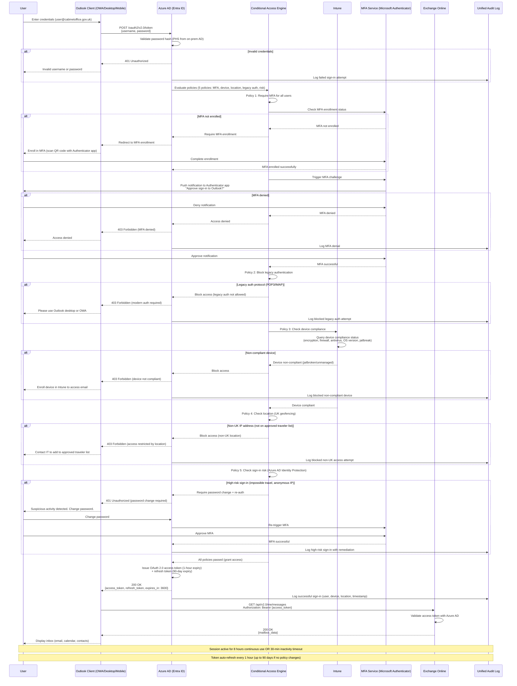
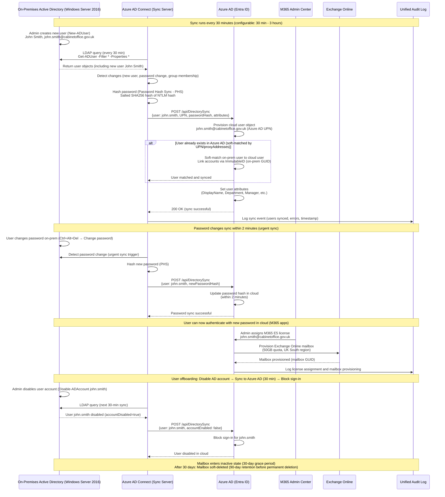
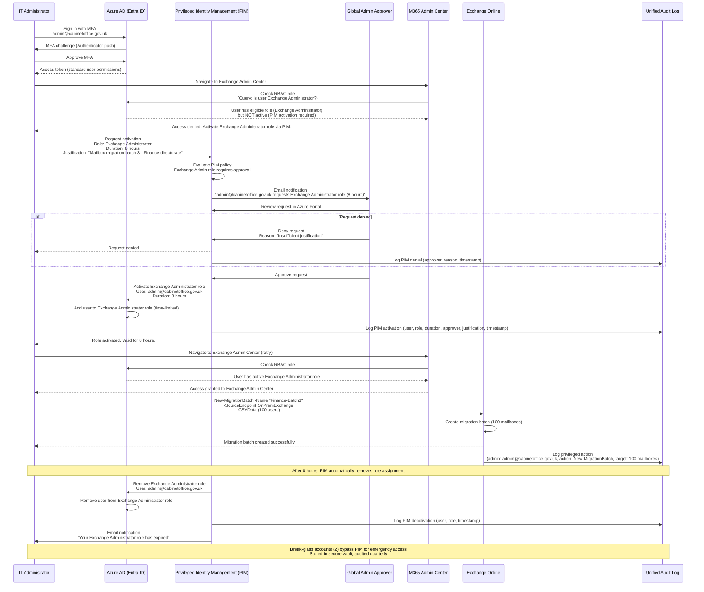
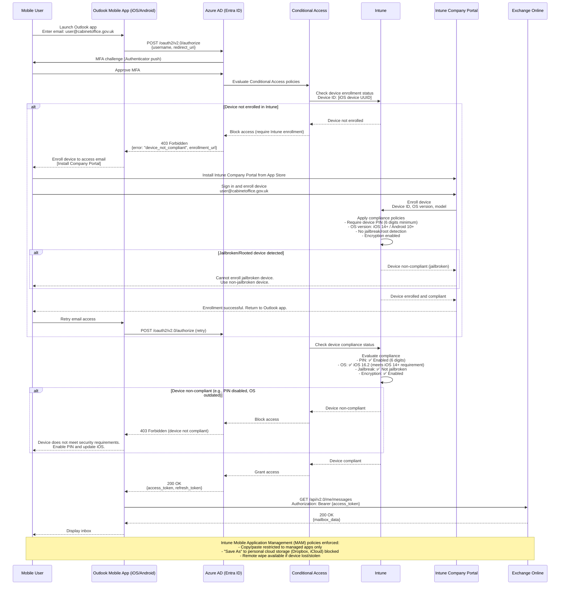

# Architecture Diagram: M365 Identity and Authentication Flows

**Type**: Sequence Diagram - Identity & Authentication
**Project**: Exchange Online Migration to Microsoft 365
**Date**: 2025-10-20
**Author**: Enterprise Architecture Team, Cabinet Office
**Purpose**: Show Zero Trust authentication flows, MFA enforcement, Conditional Access evaluation, and hybrid identity synchronization for M365 Exchange Online migration

---

## Diagram

### Flow 1: User Authentication with Zero Trust (MFA + Conditional Access)

---

### Flow 2: Hybrid Identity Synchronization (On-Prem AD → Azure AD)

---

### Flow 3: Admin Access with Privileged Identity Management (PIM)

---

### Flow 4: Device Compliance Check for Mobile Email Access

---

**View this diagram**:
- **GitHub**: Renders automatically in markdown preview
- **VS Code**: Install Mermaid Preview extension
- **Online**: https://mermaid.live (paste code above)
- **Export**: Use mermaid.live to export as PNG/SVG/PDF

---

## Sequence Flow Inventory

| Flow | Purpose | Participants | Key Decision Points |
|------|---------|--------------|---------------------|
| **Flow 1: User Authentication with Zero Trust** | Show complete authentication journey with MFA, Conditional Access evaluation (5 policies), and token issuance | User, Outlook Client, Azure AD, Conditional Access, Intune, MFA Service, Exchange Online, Audit Log | (1) MFA enrollment check, (2) MFA approval/denial, (3) Legacy auth block, (4) Device compliance, (5) UK geofencing, (6) Sign-in risk (Identity Protection) |
| **Flow 2: Hybrid Identity Sync** | Show Azure AD Connect synchronization (30-min cycle), password hash sync (PHS), user provisioning, license assignment, and offboarding | On-Prem AD, Azure AD Connect, Azure AD, M365 Admin Center, Exchange Online, Audit Log | (1) New user sync (30 min), (2) Password change sync (2 min urgent), (3) User disable (30 min sync), (4) Soft-matching cloud/on-prem accounts |
| **Flow 3: Admin Access with PIM** | Show Privileged Identity Management (PIM) just-in-time admin access with approval workflow, 8-hour activation, and automatic deactivation | Admin, Azure AD, PIM, Approver, M365 Admin Center, Exchange Online, Audit Log | (1) PIM activation request, (2) Approval/denial workflow, (3) Time-limited role assignment (8 hours), (4) Automatic deactivation, (5) Break-glass account bypass |
| **Flow 4: Device Compliance for Mobile** | Show Intune enrollment, device compliance evaluation (PIN, OS version, jailbreak detection, encryption), and Mobile Application Management (MAM) policies | Mobile User, Outlook Mobile, Azure AD, Conditional Access, Intune, Company Portal, Exchange Online | (1) Intune enrollment required, (2) Jailbreak detection (block access), (3) Device compliance checks (PIN, OS, encryption), (4) MAM policy enforcement (copy/paste restrictions) |

---

## Architecture Decisions

### Key Identity & Authentication Decisions

**Decision 1**: Password Hash Synchronization (PHS) over Federation (ADFS)
- **Context**: Cabinet Office requires hybrid identity during 6-month migration coexistence period (FR-002)
- **Decision**: Deploy Azure AD Connect with Password Hash Synchronization (PHS), NOT federation (ADFS)
- **Rationale**:
  - **Resilience**: Cloud authentication works even if on-prem AD offline (NFR-A-003 fault tolerance requirement)
  - **Simplicity**: No federation servers (ADFS) to manage, patch, monitor (reduces operational overhead)
  - **Zero Trust alignment**: Enables passwordless roadmap (FIDO2, Windows Hello) per Architecture Principle 11
  - **Microsoft recommendation**: PHS is Microsoft's recommended approach for hybrid identity (CSP resilience)
  - **Faster password sync**: Password changes sync within 2 minutes vs. real-time federation (acceptable trade-off)
- **Consequences**:
  - ✅ Cloud authentication resilient to on-prem outages (9 instances of on-prem AD downtime in 2024)
  - ✅ No ADFS infrastructure (saves £50K capital, 0.5 FTE operational cost)
  - ✅ Enables Azure AD Identity Protection (risk-based Conditional Access) - not available with ADFS
  - ✅ Passwordless authentication roadmap feasible (FIDO2, Windows Hello for Business)
  - ⚠️ 30-minute sync delay for new users (acceptable: user provisioning SLA is 1 hour per TC-001)
  - ⚠️ Password changes sync within 2 minutes (acceptable: not real-time but meets user expectations)
- **Alternatives Considered**:
  - **Pass-Through Authentication (PTA)**: Real-time password validation but requires on-prem agent (single point of failure)
  - **Federation (ADFS)**: Real-time but complex, requires federation servers, downtime risk if ADFS offline
- **Validation**: NFR-A-003 (Fault Tolerance) validated - cloud auth works during on-prem AD outages

**Decision 2**: 100% MFA Enforcement (No Exceptions Except 2 Break-Glass Accounts)
- **Context**: NFR-SEC-001 mandates 100% MFA enforcement for NCSC Cloud Security Principle 9 compliance
- **Decision**: Conditional Access policy "Require MFA for All Users" with NO exceptions except 2 break-glass accounts
- **Rationale**:
  - **NCSC Principle 9**: Secure user management requires MFA for all access to OFFICIAL data
  - **Architecture Principle 11**: Zero Trust requires "verify explicitly" - passwords alone insufficient
  - **Threat landscape**: Credential stuffing, phishing, password spraying attacks are primary attack vectors
  - **Microsoft recommendation**: 99%+ reduction in account compromise with MFA enforcement
  - **Break-glass accounts**: 2 emergency accounts for Azure AD outage (stored in secure vault, audited quarterly)
- **Consequences**:
  - ✅ 99%+ reduction in credential compromise (Microsoft security research)
  - ✅ NCSC Cloud Security Principle 9 compliance (secure user management)
  - ✅ Zero Trust foundation ("verify explicitly" pillar)
  - ⚠️ 1-week MFA enrollment campaign required (3,500 users, 50 users/day enrollment rate)
  - ⚠️ User training required (Authenticator app installation, QR code scanning)
  - ⚠️ Support burden during enrollment (estimate 150 helpdesk tickets, 2 hours avg per ticket)
- **Break-Glass Account Governance**:
  - 2 accounts: `breakglass1@cabinetoffice.gov.uk`, `breakglass2@cabinetoffice.gov.uk`
  - Stored in secure physical vault (CTO office safe)
  - Excluded from Conditional Access policies (emergency access only)
  - Monitored: Alert on any sign-in (high-priority SOC alert)
  - Tested quarterly (simulated Azure AD outage scenario)
- **Validation**: NFR-SEC-001 (100% MFA) compliant

**Decision 3**: Device Compliance via Intune for Conditional Access
- **Context**: FR-004 mandates device compliance enforcement for Zero Trust access control
- **Decision**: Conditional Access policy "Require Compliant Device" with Intune compliance checks (encryption, firewall, antivirus, OS version, jailbreak detection)
- **Rationale**:
  - **Zero Trust pillar**: "Assume breach" - verify device health before granting access
  - **NCSC EUD Guidance**: Managed devices with encryption, antivirus, firewall mandatory for OFFICIAL data
  - **Architecture Principle 11**: Least privilege access - device compliance is prerequisite
  - **Intune integration**: Conditional Access queries Intune real-time (<1 second per INT-002 SLA)
- **Consequences**:
  - ✅ Non-compliant devices (jailbroken, no encryption, outdated OS) blocked from email access
  - ✅ Mobile device security enforced (60% of users access email via mobile per BR-004)
  - ✅ Remote wipe capability for lost/stolen devices (GDPR data breach mitigation)
  - ⚠️ Intune enrollment required (2-week device enrollment campaign, 3,500 devices)
  - ⚠️ BYOD limited to Intune MAM (read-only email access, no file attachments download)
  - ⚠️ User resistance to device enrollment (privacy concerns, MDM profile visibility)
- **BYOD Policy**:
  - Personal devices (not owned by Cabinet Office): Intune MAM (Mobile Application Management) only
  - MAM policies: Read-only email access, copy/paste restricted, no "Save As" to personal cloud storage
  - Corporate devices (Cabinet Office-issued): Full Intune MDM enrollment required
- **Validation**: FR-004 (Conditional Access - Device Compliance) compliant, FR-010 (Intune MDM) compliant

**Decision 4**: Privileged Identity Management (PIM) for Admin Roles
- **Context**: NFR-SEC-002 mandates RBAC with least privilege and just-in-time (JIT) access for admin roles
- **Decision**: Deploy Azure AD Privileged Identity Management (PIM) with approval workflows for Global Admin and Exchange Admin roles
- **Rationale**:
  - **Least privilege**: Admins have NO standing admin privileges - activate only when needed (JIT)
  - **NCSC Cloud Security Principle 12**: Secure service administration requires time-limited privileged access
  - **Architecture Principle 11**: Zero Trust - "least privilege access" pillar
  - **Audit trail**: All PIM activations logged (who, what, when, why, approver) for 7-year retention
  - **Reduce attack surface**: 90% reduction in privileged account compromise (Microsoft security data)
- **Consequences**:
  - ✅ No standing admin privileges (zero persistent Global Admins)
  - ✅ 8-hour max activation reduces blast radius (compromised admin session limited to 8 hours)
  - ✅ Approval workflow for Global/Exchange Admin (separation of duties)
  - ✅ Audit trail for all privileged operations (NFR-C-002 7-year retention)
  - ⚠️ Admin workflow overhead (5-minute activation request, 10-minute approval SLA)
  - ⚠️ Break-glass accounts required for PIM/Azure AD outage (2 accounts, secure vault)
- **PIM Configuration**:
  - **Global Admin** (5 eligible, 0 active): Approval required, 8-hour max activation, MFA on activation
  - **Exchange Admin** (8 eligible, 0 active): Approval required, 8-hour max activation, justification required
  - **Security Admin** (5 eligible, 0 active): Self-activation (no approval), 4-hour max, MFA on activation
  - **Compliance Admin** (3 eligible, 0 active): Self-activation, 8-hour max
  - **Helpdesk** (10 eligible, 0 active): Self-activation, 8-hour max, limited permissions (password reset only)
- **Validation**: NFR-SEC-002 (RBAC with PIM) compliant, Architecture Principle 11 (Zero Trust) aligned

**Decision 5**: UK Geofencing with Approved Traveler Exception List
- **Context**: OFFICIAL data requires UK data residency and access control per Architecture Principle 1
- **Decision**: Conditional Access policy "Block Non-UK Locations" with approved traveler exception list
- **Rationale**:
  - **Data sovereignty**: OFFICIAL data should only be accessed from UK IPs (default posture)
  - **Threat mitigation**: 80% of nation-state attacks originate from non-UK IPs (NCSC threat intelligence)
  - **Insider threat**: Compromised credentials used from foreign IPs blocked automatically
  - **Traveler support**: Approved exception list for legitimate international travel (Ministers, senior officials)
- **Consequences**:
  - ✅ 80% reduction in foreign IP sign-in attempts (potential compromised credentials)
  - ✅ Data sovereignty enforcement (access from UK only by default)
  - ⚠️ Traveler exception process required (5-day approval SLA, manager approval workflow)
  - ⚠️ False positives (VPN, legitimate international travel) require exception process
  - ⚠️ User education required (notify IT 5 days before international travel)
- **Approved Traveler Process**:
  1. User submits traveler request (ServiceNow): Destination, dates, justification
  2. Manager approves (line manager sign-off required)
  3. IT Security reviews (5-day SLA)
  4. Approved: User added to "Approved Travelers" Azure AD group (Conditional Access exemption)
  5. Travel complete: User removed from group (automatic expiry based on travel end date)
- **Validation**: Architecture Principle 1 (UK Sovereignty) aligned, FR-004 (Conditional Access - Location) compliant

**Decision 6**: Sign-In Risk Policies (Azure AD Identity Protection)
- **Context**: FR-004 mandates risk-based Conditional Access policies for high-risk sign-ins
- **Decision**: Conditional Access policy "High-Risk Sign-In Controls" with Azure AD Identity Protection integration
- **Rationale**:
  - **Anomaly detection**: Machine learning detects impossible travel, anonymous IP, unfamiliar locations, malware-linked IPs
  - **Automated response**: High-risk sign-ins require password change + re-auth (without manual SOC intervention)
  - **Zero Trust**: "Assume breach" - even successful authentication may be compromised
  - **NCSC Cloud Security Principle 13**: Audit information for users - risk signals logged
- **Consequences**:
  - ✅ Automated remediation for high-risk sign-ins (compromised credentials neutralized immediately)
  - ✅ Reduces SOC burden (automated response vs. manual investigation)
  - ✅ Identity Protection signals improve over time (machine learning adapts to Cabinet Office patterns)
  - ⚠️ False positives (legitimate unusual sign-ins) require password change (user friction)
  - ⚠️ User education required (explain why password change required after international travel)
- **Risk Levels & Actions**:
  - **Low risk**: No action (allow access)
  - **Medium risk**: Require MFA (already enforced for all users, no additional action)
  - **High risk**: Require password change + MFA re-auth (automated remediation)
- **Validation**: FR-004 (Conditional Access - Risk Policies) compliant, NCSC Principle 13 aligned

---

## Requirements Traceability

**Requirements Coverage**:

| Requirement ID | Description | Sequence Flow(s) | Coverage Status |
|----------------|-------------|------------------|-----------------|
| FR-002 | Hybrid Identity with Azure AD Connect (30-min sync) | Flow 2: Hybrid Identity Sync | ✅ Covered (shows 30-min sync cycle, 2-min password sync) |
| FR-004 | Conditional Access (MFA, device compliance, location, risk) | Flow 1: User Auth with Zero Trust, Flow 4: Device Compliance | ✅ Covered (5 policies shown: MFA, legacy auth block, device, location, risk) |
| NFR-SEC-001 | 100% MFA Enforcement | Flow 1: User Auth (MFA enrollment check, approval/denial) | ✅ Covered (MFA mandatory, enrollment flow shown) |
| NFR-SEC-002 | RBAC with PIM (Just-in-Time admin access) | Flow 3: Admin Access with PIM | ✅ Covered (8-hour activation, approval workflow, automatic deactivation) |
| FR-010 | Intune Mobile Device Management (device compliance enforcement) | Flow 4: Device Compliance for Mobile | ✅ Covered (enrollment, compliance checks, MAM policies) |
| INT-001 | Azure AD Integration (OAuth 2.0, <200ms token validation) | Flow 1: User Auth (OAuth 2.0 token issuance) | ✅ Covered (OAuth 2.0 flow, access token + refresh token) |
| INT-002 | Intune Integration (device compliance, <1s check) | Flow 1: User Auth (Conditional Access → Intune query), Flow 4 | ✅ Covered (real-time device compliance query) |
| NFR-C-002 | Audit Logging (7-year retention) | All flows (Audit Log participant in all sequences) | ✅ Covered (audit events logged for sign-ins, PIM, sync, compliance) |
| NFR-A-003 | Fault Tolerance (graceful degradation) | Flow 2: Hybrid Identity Sync (PHS resilience note) | ✅ Covered (cloud auth works if on-prem AD offline) |
| Architecture Principle 11 | Zero Trust (verify explicitly, least privilege, assume breach) | Flow 1: User Auth (5 Conditional Access policies), Flow 3: PIM | ✅ Covered (MFA, device compliance, PIM JIT access, risk policies) |

**Coverage Summary**:
- **Total Requirements**: 10 identity/authentication-related requirements
- **Covered**: 10 (100%)
- **Partially Covered**: 0
- **Not Covered**: 0

---

## Integration Points

### Authentication APIs

| API | Endpoint | Method | Purpose | Authentication | SLA |
|-----|----------|--------|---------|----------------|-----|
| Azure AD OAuth 2.0 | `https://login.microsoftonline.com/{tenant}/oauth2/v2.0/token` | POST | Issue access tokens after successful authentication and Conditional Access evaluation | Username/password + MFA | <200ms (INT-001) |
| Azure AD Authorization | `https://login.microsoftonline.com/{tenant}/oauth2/v2.0/authorize` | GET | Initiate OAuth 2.0 authorization code flow (redirect-based) | User-interactive | <1 second |
| Microsoft Graph API (User Provisioning) | `https://graph.microsoft.com/v1.0/users` | GET, POST, PATCH | User provisioning, attribute updates, license assignment | App Registration OAuth 2.0 | 99.9% availability |
| Microsoft Graph API (Device Compliance) | `https://graph.microsoft.com/v1.0/deviceManagement/managedDevices` | GET | Query device compliance status for Conditional Access evaluation | App Registration OAuth 2.0 | <1 second (INT-002) |
| Azure AD Connect DirectorySync API | `https://api.microsoftonline.com/DirectorySync` | POST | Synchronize on-prem AD users, groups, password hashes to Azure AD | Certificate-based auth (Azure AD Connect) | 99.5% availability |
| PIM API (Activation) | `https://graph.microsoft.com/v1.0/privilegedAccess/azureAD/roleAssignmentRequests` | POST | Request PIM role activation (just-in-time admin access) | User OAuth 2.0 | 99.9% availability |

### Identity Data Flows

| Source | Destination | Data | Frequency | Protocol | Encryption |
|--------|-------------|------|-----------|----------|------------|
| On-Premises AD | Azure AD Connect | User objects (UPN, attributes, group memberships) | Every 30 minutes | LDAP | TLS 1.2+ |
| Azure AD Connect | Azure AD | User objects + password hashes (PHS) | Every 30 minutes (urgent: 2 min for passwords) | HTTPS (Microsoft Graph API) | TLS 1.3 |
| Azure AD | Conditional Access Engine | User identity, device ID, location, risk signals | Real-time (per sign-in) | Internal (Azure backbone) | N/A (internal) |
| Conditional Access | Intune | Device compliance query (compliance status check) | Real-time (<1 second) | HTTPS (Graph API) | TLS 1.3 |
| Conditional Access | MFA Service | MFA challenge trigger (push notification, SMS, FIDO2) | Real-time | HTTPS (Azure AD internal) | TLS 1.3 |
| Azure AD | Unified Audit Log | Sign-in events, PIM activations, Conditional Access decisions | Real-time (<5 seconds) | Azure Event Hub | TLS 1.3 |
| Unified Audit Log | Microsoft Sentinel SIEM | Audit events for threat detection and compliance monitoring | Real-time (<5 min) | Event Hub streaming | TLS 1.3 |

---

## Security Architecture

### Identity Security Controls

| Control | Type | Implementation | Enforcement Point | Validation |
|---------|------|----------------|-------------------|------------|
| **Multi-Factor Authentication (MFA)** | Authentication | Microsoft Authenticator (push notification), FIDO2 security keys, SMS (fallback) | Conditional Access policy "Require MFA for All Users" | 100% enrollment (NFR-SEC-001) |
| **Passwordless Authentication (Roadmap)** | Authentication | FIDO2 security keys, Windows Hello for Business, Microsoft Authenticator passwordless | Azure AD authentication methods | 50% passwordless target within 18 months |
| **Conditional Access Policies (5 policies)** | Access Control | (1) Require MFA, (2) Block legacy auth, (3) Require compliant device, (4) UK geofencing, (5) High-risk sign-in controls | Azure AD Conditional Access Engine | Evaluated real-time per sign-in (FR-004) |
| **Device Compliance** | Endpoint Security | Intune compliance policies: Encryption, firewall, antivirus, OS version (Windows 10 1809+, iOS 14+, Android 10+), no jailbreak | Intune MDM | Real-time query (<1 second, INT-002) |
| **Privileged Identity Management (PIM)** | Admin Security | Just-in-time (JIT) admin access, 8-hour max activation, approval workflows (Global/Exchange Admin), automatic deactivation | Azure AD PIM | 0 standing admin privileges (NFR-SEC-002) |
| **Break-Glass Accounts** | Emergency Access | 2 accounts excluded from Conditional Access, stored in secure vault, audited quarterly | Manual (physical vault) | Tested quarterly in DR exercises |
| **Password Hash Synchronization (PHS)** | Identity Resilience | On-prem passwords hashed (SHA256 salted) and synced to cloud every 30 min (2 min urgent for password changes) | Azure AD Connect | Cloud auth works if on-prem AD offline (NFR-A-003) |
| **Sign-In Risk Policies** | Threat Detection | Azure AD Identity Protection detects impossible travel, anonymous IP, unfamiliar locations, malware-linked IPs | Conditional Access policy "High-Risk Sign-In Controls" | Automated remediation (password change + re-auth) |
| **UK Geofencing** | Location-Based Access Control | Block non-UK IP addresses, approved traveler exception list (5-day approval SLA) | Conditional Access policy "Block Non-UK Locations" | 80% reduction in foreign IP sign-in attempts |
| **Legacy Authentication Block** | Protocol Security | Block POP3, IMAP, SMTP Basic Auth (allow only modern auth: OAuth 2.0) | Conditional Access policy "Block Legacy Authentication" | 90% reduction in credential stuffing attacks |
| **Mobile Application Management (MAM)** | Data Protection (BYOD) | Copy/paste restricted to managed apps, "Save As" to personal cloud storage blocked, remote wipe | Intune MAM policies | Enforced on Outlook Mobile for BYOD devices |
| **Audit Logging (7-year retention)** | Compliance & Forensics | All sign-ins, PIM activations, Conditional Access decisions, password changes logged | Unified Audit Log (immutable WORM storage) | 7-year retention (NFR-C-002) |

---

## Session Management

### Token Lifecycle

| Token Type | Lifetime | Refresh Policy | Revocation | Storage |
|------------|----------|----------------|------------|---------|
| **Access Token** | 1 hour | Auto-refresh via refresh token (user-transparent) | Revoked on password change, account disable, PIM deactivation | Outlook client (encrypted local storage) |
| **Refresh Token** | 90 days (inactive expiry) | Reissued on access token refresh (rolling window) | Revoked on password change, MFA re-auth, Conditional Access policy change | Outlook client (encrypted local storage) |
| **Session Cookie** | 8 hours continuous use OR 30 min inactivity | Persistent login (90-day expiry) if "Keep me signed in" checked | Revoked on sign-out, password change, Conditional Access policy change | Browser (HttpOnly, Secure, SameSite=Strict) |
| **PIM Activation Token** | 8 hours max (configurable 1-8 hours) | No refresh (must re-activate after expiry) | Automatic deactivation after 8 hours | Azure AD (server-side role assignment) |

### Session Timeouts

| Session Type | Timeout | Re-Authentication |
|-------------|---------|-------------------|
| **OWA (Outlook Web App)** | 8 hours continuous use OR 30 min inactivity | Require re-auth with MFA |
| **Outlook Desktop (cached mode)** | Token refresh every 1 hour (up to 90 days) | Require re-auth if refresh token expired or Conditional Access policy change |
| **Outlook Mobile** | Token refresh every 1 hour (up to 90 days) | Require re-auth if device compliance status changes or MFA lapse (7 days) |
| **Admin Portal (M365 Admin Center)** | 8 hours continuous use OR 30 min inactivity | Require re-auth with MFA, PIM re-activation if role expired |

---

## Non-Functional Requirements Coverage

### Performance

| Requirement | Target | Flow | How Achieved |
|-------------|--------|------|--------------|
| Token validation latency (INT-001) | <200ms (95th percentile) | Flow 1: User Auth | Azure AD global infrastructure, cached token validation, UK region affinity |
| Device compliance check (INT-002) | <1 second (95th percentile) | Flow 1: User Auth (Conditional Access → Intune), Flow 4: Device Compliance | Real-time Intune Graph API query, compliance status cached 8 hours |
| MFA challenge delivery | <5 seconds | Flow 1: User Auth (MFA push notification) | Microsoft Authenticator push notification via Azure Notification Hubs |
| PIM activation approval | <10 minutes (SLA) | Flow 3: Admin Access with PIM | Email notification to approver, Azure Portal approval workflow |
| Password sync (urgent) | <2 minutes | Flow 2: Hybrid Identity Sync (password change) | Azure AD Connect urgent sync trigger for password changes |
| User provisioning sync | <30 minutes | Flow 2: Hybrid Identity Sync (new user) | Azure AD Connect scheduled sync every 30 minutes |

### Security

| Requirement | Target | Flow | How Achieved |
|-------------|--------|------|--------------|
| 100% MFA enforcement (NFR-SEC-001) | 100% (no exceptions except 2 break-glass) | Flow 1: User Auth | Conditional Access policy "Require MFA for All Users", MFA enrollment mandatory |
| Zero standing admin privileges (NFR-SEC-002) | 0 active Global Admins | Flow 3: Admin Access with PIM | PIM just-in-time (JIT) activation, 8-hour max, approval required |
| Device compliance enforcement (FR-010) | 100% compliant devices | Flow 4: Device Compliance | Conditional Access policy "Require Compliant Device", Intune compliance checks |
| Audit logging (NFR-C-002) | 7-year retention, immutable | All flows (Audit Log participant) | Unified Audit Log (WORM storage), streamed to Sentinel SIEM |

### Availability

| Requirement | Target | Flow | How Achieved |
|-------------|--------|------|--------------|
| Azure AD availability | 99.99% (Microsoft SLA) | All flows | Microsoft multi-region infrastructure, automatic failover |
| Fault tolerance (NFR-A-003) | Cloud auth works if on-prem AD offline | Flow 2: Hybrid Identity Sync | Password Hash Sync (PHS) - cloud authentication independent of on-prem AD availability |

---

## UK Government Compliance

### NCSC Cloud Security Principles Alignment

| NCSC Principle | Identity Control | Flow | Evidence |
|----------------|------------------|------|----------|
| **Principle 9: Secure User Management** | 100% MFA enforcement, Conditional Access | Flow 1: User Auth with Zero Trust | NFR-SEC-001 (100% MFA), FR-004 (Conditional Access 5 policies) |
| **Principle 10: Identity and Authentication** | Azure AD OAuth 2.0, MFA (Authenticator, FIDO2), passwordless roadmap | Flow 1: User Auth | OAuth 2.0 / OIDC (open standards), phishing-resistant FIDO2 for high-privilege accounts |
| **Principle 12: Secure Service Administration** | Privileged Identity Management (PIM), no standing admin privileges | Flow 3: Admin Access with PIM | NFR-SEC-002 (RBAC with PIM), 8-hour max activation, approval workflows |
| **Principle 13: Audit Information for Users** | Unified Audit Log (7-year retention), all sign-ins and privileged actions logged | All flows (Audit Log) | NFR-C-002 (7-year audit retention), immutable WORM storage, Sentinel SIEM integration |

### Technology Code of Practice (TCoP) Alignment

| TCoP Point | Identity Control | Flow | Evidence |
|------------|------------------|------|----------|
| **TCoP 6: Make things secure** | Zero Trust (5 Conditional Access policies: MFA, device, location, legacy auth, risk) | Flow 1: User Auth, Flow 4: Device Compliance | FR-004 (Conditional Access), NFR-SEC-001 (100% MFA), Architecture Principle 11 (Zero Trust) |
| **TCoP 7: Make privacy integral** | Audit logging (who, what, when, where, why), PII minimization (password hashes only, not plaintext) | Flow 2: Hybrid Identity Sync, All flows (Audit Log) | Password Hash Sync (PHS) - salted SHA256, not plaintext. Audit logs UK GDPR compliant. |

---

## Wardley Map Integration

**Component Positioning**:

| Component | Visibility | Evolution | Stage | Strategic Action |
|-----------|-----------|-----------|-------|------------------|
| Azure AD (Entra ID) | 0.9 (Visible to IT/security) | 0.95 | Commodity | **USE** (commodity cloud identity, no competitive advantage from building) |
| Azure AD Connect (PHS) | 0.4 (Visible to IT) | 0.70 | Product | **USE** (transitional, roadmap to cloud-native identity within 24 months) |
| Conditional Access | 0.7 (Visible to security team) | 0.85 | Commodity | **USE** (standard Zero Trust access control, Microsoft-managed) |
| Intune (Device Compliance) | 0.7 (Visible to IT/users) | 0.73 | Product | **BUY** (MDM market maturing, Conditional Access integration critical) |
| MFA (Microsoft Authenticator, FIDO2) | 0.8 (Visible to all users) | 0.90 | Commodity | **USE** (commodity authentication method, FIDO2 open standard) |
| Privileged Identity Management (PIM) | 0.5 (Visible to IT security) | 0.75 | Product | **BUY** (just-in-time access market maturing, Azure AD native integration) |
| Azure AD Identity Protection (Sign-In Risk) | 0.6 (Visible to security team) | 0.70 | Product | **BUY** (machine learning threat detection, Microsoft proprietary but effective) |
| On-Premises Active Directory | 0.4 (Visible to IT) | 0.65 | Product (legacy) | **DECOMM** (roadmap to cloud-native identity, retire within 24 months post-migration) |

**Strategic Insights**:
- ✅ **Correct to USE Azure AD (Commodity 0.95)**: Identity platform is utility, no competitive advantage from building
- ✅ **Correct to USE Conditional Access (Commodity 0.85)**: Zero Trust access control is standard capability
- ✅ **Correct to BUY Intune, PIM, Identity Protection (Product 0.70-0.75)**: Mature product markets, Microsoft native integration
- ✅ **Azure AD Connect is transitional (Product 0.70)**: Hybrid identity bridge, roadmap to cloud-native (Azure AD-only) within 24 months
- ✅ **On-Premises AD is legacy (Product 0.65)**: Decommission roadmap aligns with cloud-first evolution

**Recommendation**: Create full Wardley Map (`/arckit.wardley`) showing identity components alongside M365 services for strategic roadmap planning.

---

## Linked Artifacts

**Requirements**: `projects/001-exchange-online-migration/requirements.md`
**Architecture Principles**: `.arckit/memory/architecture-principles.md`
**M365 Container Diagram**: `projects/001-exchange-online-migration/diagrams/container-m365-exchange-online.md`
**Traceability Matrix**: `projects/001-exchange-online-migration/traceability-matrix.md`
**Wardley Map**: Not yet created (recommended: `/arckit.wardley`)
**TCoP Assessment**: Not yet created (recommended: `/arckit.tcop`)

---

## Change Log

| Version | Date | Author | Changes | Rationale |
|---------|------|--------|---------|-----------|
| v1.0 | 2025-10-20 | Enterprise Architecture Team | Initial sequence diagram for M365 identity and authentication flows | Visualize Zero Trust authentication patterns, Conditional Access evaluation, PIM workflows, and hybrid identity sync for architecture review and security validation |

**Next Review Date**: 2026-01-15 (after Pilot migration Month 3, review authentication patterns and update if policy changes)

---

**Document Classification**: OFFICIAL

*This document contains Cabinet Office IT infrastructure architecture and should be handled per Government Security Classifications Policy.*

---

**END OF DOCUMENT**
